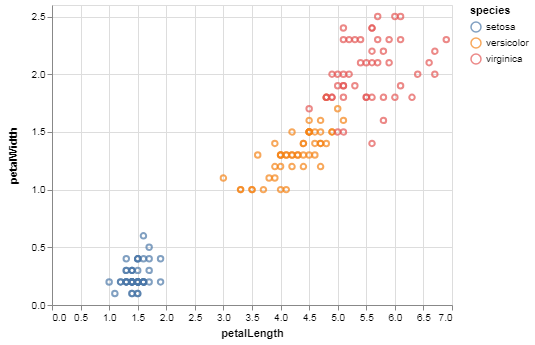

# Altair

`Altair` es una biblioteca de `python` de código abierto para la visualización de datos basada en `Vega` y `Vega-Lite`.

`Altair` utiliza lo que se conoce como “gramática de gráficos”. El énfasis es en _describir_ la apariencia visual y el comportamiento interactivo de tu visualización. La simplicidad de `altair` (que proviene de utilizar `Vega` y `Vega-lite`) la vuelve una herramienta muy eficáz para explorar y presentar datos.

## Instalación
[Instrucciones completas en la documentación de Altair](https://altair-viz.github.io/getting_started/installation.html)

### Jupyter Lab
La mejor manera de trabajar con `altair` es en `Jupyter Lab`. Se recomienda crear un nuevo entorno virtual (puedes utilizar cualquier biblioteca que te guste `pipenv`, `conda`, `virtualenv`).
Ya que hayas creado tu entorno puedes instalar `altair` y `jupyter lab` fácilmente con `pip` o `conda`.

#### Conda
```sh
conda install -c conda-forge altair vega_datasets jupyterlab
```
#### Pip
```sh
pip install -U altair vega_datasets jupyterlab
```

Notarás que estas instalando 3 biblioteca, `vega_datasets` contiene varios conjuntos de datos (_datasets_) con los que puedes recrear los ejemplos de la galería de `altair` [(en su documentación online)](https://altair-viz.github.io/gallery/index.html)

__NOTA:__ `-c conda-forge` solo le esta indicando a `conda` que utilize el canal _conda-forge_ para instalar las bibliotecas. Más sobre eso en la [documentación](https://conda.io/docs/user-guide/tasks/manage-channels.html) de `conda` (esta en inglés).

ya que hayas instalado lo necesario puedes ejecutar lo siguiente desde tu línea de comando:
```sh
jupyter lab
```

Dentro del __lab__ puedes crear un __notebook__ nuevo y ejecutar el siguiente código para asegurar que todo este funcionando:


{:.input_area}
```python
import altair as alt
from vega_datasets import data

iris = data.iris()

alt.Chart(iris).mark_point().encode(
    x='petalLength',
    y='petalWidth',
    color='species'
)
```


{:.output .output_png}



### Jupyter Notebook
Si prefieres trabajar en __jupyter notebooks__ (y no en el __lab__) necesitarás instalar también la biblioteca `vega`, de igual manera puedes hacerlo con `conda` o `pip`:

#### Conda
```sh
conda install -c conda-forge altair vega_datasets notebook vega
```
#### Pip
```sh
pip install -U altair vega_datasets notebook vega
```

Ya instalado puedes ejecutar:
```sh
jupyter notebook
```

__NOTA:__ Si vas a utilizar `altair` en __jupyter notebook__ vas a tener que ejecutar `alt.renderers.enable('notebook')` para poder exhibir tus gráficos en el __notebook__.
El mismo ejemplo de arriba sería:
```python
import altair as alt
from vega_datasets import data

alt.renderers.enable('notebook')

iris = data.iris()

alt.Chart(iris).mark_point().encode(
    x='petalLength',
    y='petalWidth',
    color='species'
)
```

### Google Colab
Si quieres utilizar `altair` en un  __Google Colab Notebook__ no necesitas instalar nada. Sólo [crea un nuevo __notebook__ y ponte a visualizar](https:colab.research.google.com/)
