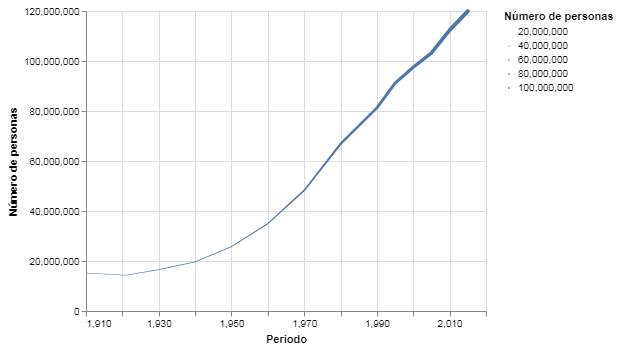

---
redirect_from:
  - "/section-02/2/grafico-de-lineas"
interact_link: content/section-02/2/grafico_de_lineas.ipynb
kernel_name: python3
title: 'Gráfico de Líneas'
prev_page:
  url: /section-02/1/grafico_de_barras
  title: 'Gráfico de Barras'
next_page:
  url: /section-02/3/grafico_de_dispersion
  title: 'Gráfico de Dispersíon'
comment: "***PROGRAMMATICALLY GENERATED, DO NOT EDIT. SEE ORIGINAL FILES IN /content***"
---

# Gráfico de Líneas

***
Un gráfico de líneas esta compuesto por líneas continuas que conectan una pareja de valores (x,y) con la siguiente con una línea directa entre los dos puntos.

Así es como se produce un gráfico de líneas en `altair`:


{:.input_area}
```python
# primero importamos las bibliotecas necesarias
# estos alias son convenciones populares
# pero no son requisitos estrictos

import pandas as pd
import altair as alt
```


Si estas trabajando con este __notebook__ en un __jupyter notebook__ y no el __jupyter lab__ requerirás ejecutar el siguiente código también.


{:.input_area}
```python
alt.renderers.enable("notebook")
```


Los datos con los que vamos a trabajar son de [INEGI](https://inegi.org.mx). En este caso, el número de personas en el país desde 1910.


{:.input_area}
```python
datos = pd.read_csv("../../datos/poblacion.csv")
```


Puedes explorar el __DataFrame__ con el método `.head()` para observar las primeras líneas.


{:.input_area}
```python
datos.head()
```


<div markdown="0" class="output output_html">
<div>
<style scoped>
    .dataframe tbody tr th:only-of-type {
        vertical-align: middle;
    }

    .dataframe tbody tr th {
        vertical-align: top;
    }

    .dataframe thead th {
        text-align: right;
    }
</style>
<table border="1" class="dataframe">
  <thead>
    <tr style="text-align: right;">
      <th></th>
      <th>Periodo</th>
      <th>Número de personas</th>
    </tr>
  </thead>
  <tbody>
    <tr>
      <th>0</th>
      <td>1910</td>
      <td>15160369</td>
    </tr>
    <tr>
      <th>1</th>
      <td>1921</td>
      <td>14334780</td>
    </tr>
    <tr>
      <th>2</th>
      <td>1930</td>
      <td>16552722</td>
    </tr>
    <tr>
      <th>3</th>
      <td>1940</td>
      <td>19653552</td>
    </tr>
    <tr>
      <th>4</th>
      <td>1950</td>
      <td>25791017</td>
    </tr>
  </tbody>
</table>
</div>
</div>


## Visualización


{:.input_area}
```python
alt.Chart(datos).mark_line().encode(
    x = 'Periodo',
    y = 'Número de personas',
)
```


{:.output .output_png}


### Bonus
Existe otro marcador para crear líneas: `.mark_trail()`. 
_trail_ se traduce a camino. Este marcador es como el marcador de línea, pero tiene otras propiedades que puedes _codificar_ con tus datos. Por ejemplo, el grosor (`size`) de la línea (o el camino) en tu visualización.


{:.input_area}
```python
alt.Chart(datos).mark_trail().encode(
    x = 'Periodo',
    y = 'Número de personas',
    size = 'Número de personas',
)
```


{:.output .output_png}



