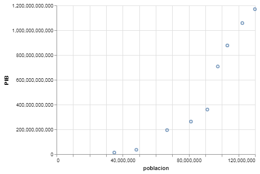
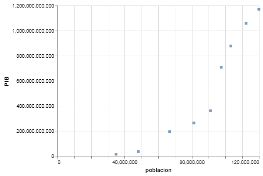

---
redirect_from:
  - "/section-02/3/grafico-de-dispersion"
interact_link: content/section-02/3/grafico_de_dispersion.ipynb
kernel_name: python3
title: 'Gráfico de Dispersíon'
prev_page:
  url: /section-02/2/grafico_de_lineas
  title: 'Gráfico de Líneas'
next_page:
  url: /section-02/4/grafico_de_area
  title: 'Gráfico de Area'
comment: "***PROGRAMMATICALLY GENERATED, DO NOT EDIT. SEE ORIGINAL FILES IN /content***"
---

# Gráfico de Dispersión

***
Un gráfico de dispersión visualiza la relación entre dos variables, como una afecta a la otra.

Así es como se produce un gráfico de dispersión en `altair`:


{:.input_area}
```python
# primero importamos las bibliotecas necesarias
# estos alias son convenciones populares
# pero no son requisitos estrictos

import pandas as pd
import altair as alt
```


Si estas trabajando con este __notebook__ en un __jupyter notebook__ y no el __jupyter lab__ requerirás ejecutar el siguiente código también.


{:.input_area}
```python
alt.renderers.enable("notebook")
```


Los datos con los que vamos a trabajar son de [INEGI](https://inegi.org.mx) y del [Banco Mundial](https://data.worldbank.org/indicator/NY.GDP.MKTP.CD?locations=MX). En este caso, el número de personas en el país y el producto interno bruto (PIB).


{:.input_area}
```python
datos = pd.read_csv("../../datos/pib.csv")
```


Puedes explorar el __DataFrame__ con el método `.head()` para observar las primeras líneas.


{:.input_area}
```python
datos.head()
```


<div markdown="0" class="output output_html">
<div>
<style scoped>
    .dataframe tbody tr th:only-of-type {
        vertical-align: middle;
    }

    .dataframe tbody tr th {
        vertical-align: top;
    }

    .dataframe thead th {
        text-align: right;
    }
</style>
<table border="1" class="dataframe">
  <thead>
    <tr style="text-align: right;">
      <th></th>
      <th>periodo</th>
      <th>poblacion</th>
      <th>PIB</th>
    </tr>
  </thead>
  <tbody>
    <tr>
      <th>0</th>
      <td>1960</td>
      <td>34923129</td>
      <td>1.304000e+10</td>
    </tr>
    <tr>
      <th>1</th>
      <td>1970</td>
      <td>48225238</td>
      <td>3.552000e+10</td>
    </tr>
    <tr>
      <th>2</th>
      <td>1980</td>
      <td>66846833</td>
      <td>1.943480e+11</td>
    </tr>
    <tr>
      <th>3</th>
      <td>1990</td>
      <td>81249645</td>
      <td>2.627100e+11</td>
    </tr>
    <tr>
      <th>4</th>
      <td>1995</td>
      <td>91158290</td>
      <td>3.600740e+11</td>
    </tr>
  </tbody>
</table>
</div>
</div>


## Visualización


{:.input_area}
```python
alt.Chart(datos).mark_point().encode(
    x = 'poblacion',
    y = 'PIB',
)
```


{:.output .output_png}



Con este gráfico de dispersión puedes observar la relación positiva entre el PIB de Mexico y la población.

`altair` tiene otros marcadores que funcionan muy bien para crear gráficos de dispersión también como `.mark_circle()` y `.mark_square()`. <br>
Modifica el código para crear los siguientes gráficos:




{:.input_area}
```python
# Cuadrados


```


{:.input_area}
```python
# Circulos


```


### Ejercicio
En el capítulo anterior aprendiste algunos marcadores (como `.mark_trail()`) tienen la propiedad __size__ a la cual le puedes asignar una columna de tu __DataFrame__. <br>
Modifica este gráfico para la propiedad __size__, recuerda que puedes asignarle otra columna que no hayas usado o repetir. <br>
Más adelante aprenderás como personalizar aún más tus visualizaciones y como sacarle mayor provecho a este tipo de gráficos los cuales son muy comunes en el campo académico.


{:.input_area}
```python
alt.Chart(datos).mark_point().encode(
    x = '',
    y = '',
    size = '',
)
```

