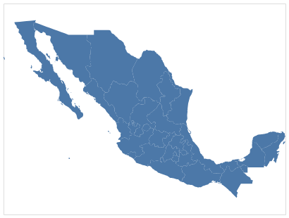
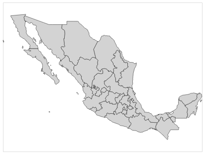
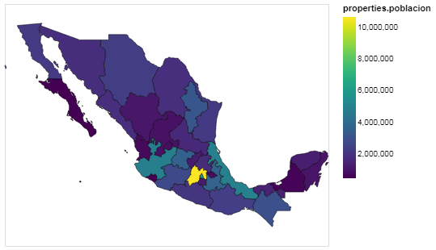

# Mapas

***
Un mapa es un conjunto de elementos de un mismo tipo o categoría que tienen una distribución espacial determinada. La mayoría de los mapas que consumimos son geográficos.


Así es como se produce un mapa en `altair`:


{:.input_area}
```python
# primero importamos las bibliotecas necesarias
# estos alias son convenciones populares
# pero no son requisitos estrictos

import altair as alt
import json
```


Si estas trabajando con este __notebook__ en un __jupyter notebook__ y no el __jupyter lab__ requerirás ejecutar el siguiente código también.


{:.input_area}
```python
alt.renderers.enable("notebook")
```


Los datos con los que vamos a trabajar son de [Diego Valle-Jones](https://diegovalle.net) y de [INEGI](http://www.beta.inegi.org.mx/app/estatal/#grafica). En este caso, es un GeoJSON de los estados de México y la población total de 15 a 59 años de edad (2014).


{:.input_area}
```python
with open("../../datos/estados.geojson", "r") as archivo:
    datos = json.load(archivo)
```


Puedes explorar el __GeoJSON__ como explorariamos cualquier otro objeto __JSON__. __GeoJSON__ es un formato estándar para codificar estructuras de datos geográficas. La estructura básica de un __GeoJSON__ es asi: <br>

```json
{
  "type": "Feature",
  "geometry": {
    "type": "Point",
    "coordinates": [125.6, 10.1]
  },
  "properties": {
    "name": "Dinagat Islands"
  }
}
```

GeoJSON admite los siguientes tipos de geometría: Point, LineString, Polygon, MultiPoint, MultiLineString y MultiPolygon. Los objetos geométricos con propiedades adicionales son objetos Feature. Los conjuntos de características están contenidos en los objetos FeatureCollection


Estos son las características de este __GeoJSON__:


{:.input_area}
```python
for key in datos['features'][1]['properties'].keys():
    print(key)
```


{:.output .output_stream}
```
Entidad
OBJECTID_1
poblacion
abbrev
adm0_a3
adm0_label
adm0_sr
adm1_cod_1
adm1_code
admin
area_sqkm
centroid_lat
centroid_lon
check_me
code_hasc
code_local
datarank
diss_me
featurecla
fips
fips_alt
gadm_level
geonunit
gn_a1_code
gn_id
gn_level
gn_name
gn_region
gns_adm1
gns_id
gns_lang
gns_level
gns_name
gns_region
gu_a3
hasc_maybe
iso_3166_2
iso_a2
labelrank
latitude
longitude
mapcolor13
mapcolor9
name
name_alt
name_len
name_local
note
postal
provnum_ne
region
region_cod
region_sub
sameascity
scalerank
sov_a3
sub_code
type
type_en
wikipedia
woe_id
woe_label
woe_name

```

Y los accesamos de la siguiente manera: 


{:.input_area}
```python
datos['features'][1]['properties']['name']
```


{:.output .output_data_text}
```
'Baja California Sur'
```


## Visualización

Recuerda que `altair` acepta datos en 3 formatos: un __DataFrame__ de `pandas`, un objeto de clase `Data` de `altair`, o un URL apuntando a _JSON_ o _CSV_ directos.

En este caso ya tenemos un __GeoJSON__ descargado así que usaremos `alt.Data` para representar nuestros datos.


{:.input_area}
```python
datos_altair = alt.Data(values = datos['features'])

type(datos_altair)
```


{:.output .output_data_text}
```
altair.vegalite.v2.schema.core.Data
```


Ahora si podemos crear un mapa utilizando nuestros datos ahora en formato `altair Data`.


{:.input_area}
```python
alt.Chart(datos_altair).mark_geoshape()
```


{:.output .output_png}



Tada! Ahora, claro que para que se vea más como un mapa de los estados de México tenemos que configurarlo diferente. Dentro de todos los marcadores (`.mark_****()`) puedes especificar ciertos aspectos de tu marcador. En este caso, `geoshape`, queremos que se muestren las delineaciones de cada estado y se sombrée el área interior. Los argumentos para hacer esto son:
* `stroke`: el color de la delineación
* `fill`: el color del sombreado

y podemos agreagar `strokeWidth` para especificar el grosor de la delineación (en pixeles).


{:.input_area}
```python
alt.Chart(datos_altair).mark_geoshape(stroke = 'black', strokeWidth=0.5, fill = 'lightgray')
```


{:.output .output_png}



Nota que en este caso no codificamos nada con `.encode()`. 

Un tipo de mapa común en la visualización de datos es un _choropleth_. Un _choropleth_ es un mapa temático en el que las áreas están sombreadas o modeladas en proporción a la medición de la variable estadística que se muestra en el mapa, como la densidad de población o el ingreso per cápita.


{:.input_area}
```python
# Poblacion total de 15 a 59 años (2014)
alt.Chart(datos_altair).mark_geoshape(stroke = 'black', fill = 'lightgray', strokeWidth=0.5).encode(
    color = 'properties.poblacion:Q',
)
```


{:.output .output_png}



