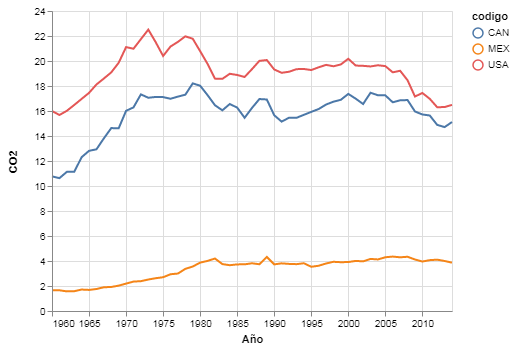
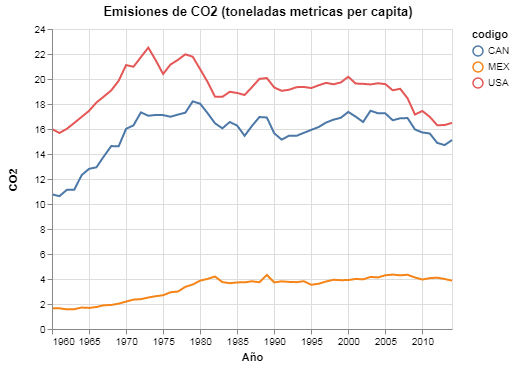
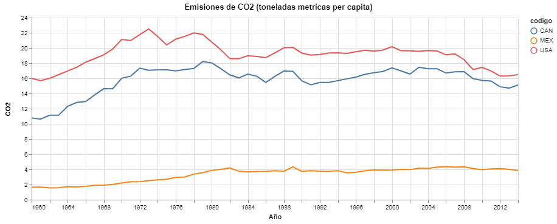

# Propiedades de un Gráfico

Utilizamos `.mark_line()` para especificar las propiedades del marcador y `.encode()` para codificar nuestros datos de la misma manera podemos utilizar `.properties()` para especificar ciertos atributos de nuestro gráfico. Más adelante aprenderemos como configurar minuciosamente todos los detalles de cada parte del gráfico, por ahora agreguemos un título y especifiquemos las dimensiones de nuestra visualización.

Como siempre, comenzamos importando nuestros paquetes de `python` y asignando nuestros datos, en este caso en formato `CSV` a un __DataFrame__ de `pandas`.


{:.input_area}
```python
import altair as alt
import pandas as pd
```


{:.input_area}
```python
datos = pd.read_csv("../../datos/norteamerica_CO2.csv")
datos.head()
```


<div markdown="0" class="output output_html">
<div>
<style scoped>
    .dataframe tbody tr th:only-of-type {
        vertical-align: middle;
    }

    .dataframe tbody tr th {
        vertical-align: top;
    }

    .dataframe thead th {
        text-align: right;
    }
</style>
<table border="1" class="dataframe">
  <thead>
    <tr style="text-align: right;">
      <th></th>
      <th>pais</th>
      <th>codigo</th>
      <th>nombre del indicador</th>
      <th>CO2</th>
      <th>periodo</th>
    </tr>
  </thead>
  <tbody>
    <tr>
      <th>0</th>
      <td>Canada</td>
      <td>CAN</td>
      <td>CO2 emissions (metric tons per capita)</td>
      <td>10.770847</td>
      <td>1960</td>
    </tr>
    <tr>
      <th>1</th>
      <td>México</td>
      <td>MEX</td>
      <td>CO2 emissions (metric tons per capita)</td>
      <td>1.653382</td>
      <td>1960</td>
    </tr>
    <tr>
      <th>2</th>
      <td>Estados Unidos</td>
      <td>USA</td>
      <td>CO2 emissions (metric tons per capita)</td>
      <td>15.999779</td>
      <td>1960</td>
    </tr>
    <tr>
      <th>3</th>
      <td>Canada</td>
      <td>CAN</td>
      <td>CO2 emissions (metric tons per capita)</td>
      <td>10.627898</td>
      <td>1961</td>
    </tr>
    <tr>
      <th>4</th>
      <td>México</td>
      <td>MEX</td>
      <td>CO2 emissions (metric tons per capita)</td>
      <td>1.657750</td>
      <td>1961</td>
    </tr>
  </tbody>
</table>
</div>
</div>


## Visualizacion

En la sección anterior aprendimos sobre `alt.X()` y `alt.Y()` para representar los valores X y Y en nuestro gráfico y especificar detalles más complejos de ellos. De ahora en adelante los usaremos por defecto. También aprendimos sobre como `altair` y `pandas` trabajan con objetos `datetime` y fechas. En este ejercicio llevaremos acabo el mismo proceso para transformar nuestra columna `"periodo"` de un __array__ de números a uno de fechas.


{:.input_area}
```python
datos['periodo'] = pd.to_datetime(datos['periodo'], format = '%Y')
```


Nuestro gráfico base bastante simple y algo que ya hemos aprendido a construir."


{:.input_area}
```python
alt.Chart(datos).mark_line().encode(
    x = alt.X('periodo:T', title = 'Año'),
    y = alt.Y('CO2:Q'),
    color = alt.Color('codigo:N')
)
```


{:.output .output_png}



Para agregar un título al gráfico solo hay que especificarlo en el método `.properties()`.


{:.input_area}
```python
alt.Chart(datos).mark_line().encode(
    x = alt.X('periodo:T', title = 'Año'),
    y = alt.Y('CO2:Q'),
    color = alt.Color('codigo:N')
).properties(
    title = "Emisiones de CO2 (toneladas metricas per capita)"
)
```


{:.output .output_png}



Las dimensiones de tu gráfico también las puedes especificar en `.properties()` bajo los argumentos `width` y `height`, lo largo y lo alto, respectivamente.


{:.input_area}
```python
alt.Chart(datos).mark_line().encode(
    x = alt.X('periodo:T', title = 'Año'),
    y = alt.Y('CO2:Q'),
    color = alt.Color('codigo:N')
).properties(
    title = "Emisiones de CO2 (toneladas metricas per capita)",
    width = 800,
    height = 300,
)
```


{:.output .output_png}



__Nota__: Si estas leyendo esto en la página del libro, te invito a que hagas clic en el botón __Interactuar__ en la parte superior de la página. En el proceso de publicar estos __notebooks__ como páginas web de este libro puede distorsionar algunas imágenes. Al hacer clic en __Interactuar__ vas a activar una instancia de este libro con todo su material y paquetes en [mybinder.org](https://mybinder.org) donde prodrás manipular el código y, más importante en este caso, observar las dimensiones reales de los gráficos que estamos creando.
